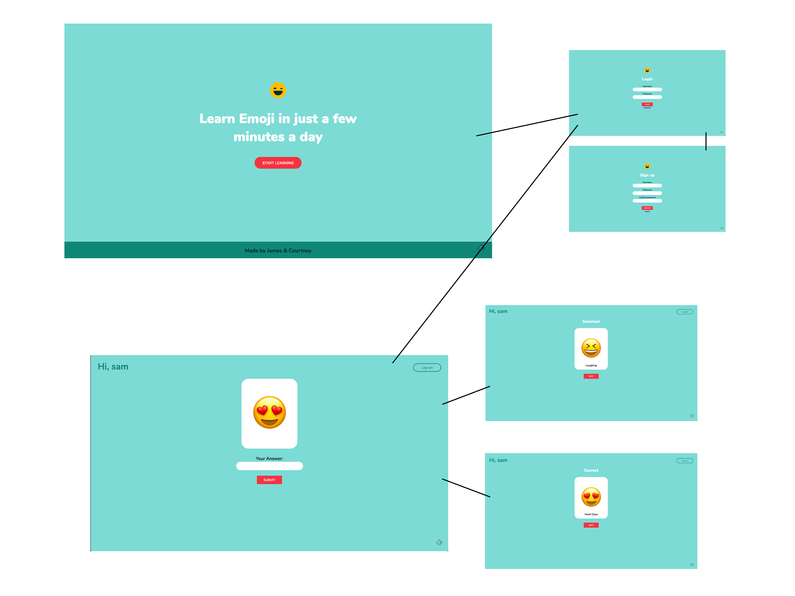
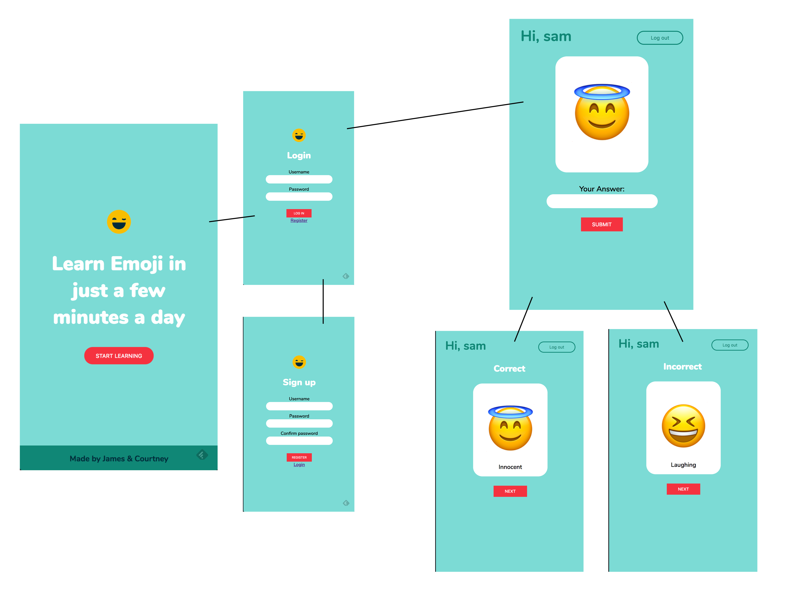

# Learn Emoji
Can't find the right words to say? Use Emojis instead! This app improves your emoji vocabulary so that you can write less and say more!
[See live app](https://spacedrep-client.herokuapp.com)

## Desktop View

## Mobile View

## Tech Stack:
#### Front End
  * React
  * Redux
  * Redux Form
  * CSS Modules
  * HTML5

#### Back End
  * MongoDB
  * Mongoose
  * Node
  * Express
  * JSON Web Token
  * Passport

[See Back end code](https://github.com/thinkful-ei21/courtney-james-spacedRepetition-server)

## Built With

* [Create React App](https://github.com/facebookincubator/create-react-app) - Front end React app
* [Front end](https://github.com/Thinkful-Ed/react-jwt-auth) - Front end template provided by Thinkful
* [Back end](https://github.com/Thinkful-Ed/backend-template) - Back end template provided by Thinkful
* [Emoji-name-map](https://www.npmjs.com/package/emoji-name-map) - Used to convert unicode to emojis

## Creators
    James [@j-stuckey](https://github.com/j-stuckey)
    Courtney [@cadams8238](https://github.com/cadams8238)
